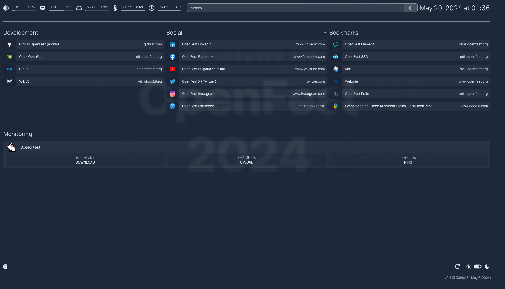

A modern, <em>fully static, fast</em>, secure <em>fully proxied</em>, highly customizable application dashboard with integrations for over 100 services and translations into multiple languages. Easily configured via YAML files or through docker label discovery.

# OpenFest dashboard ( currently in overview status )

Development URL: https://ofdash.cloudk9.eu

# NO Authentication

There is no authentication for the dashboard. The project decided to not overcomplicate it with authentication and
leave it to the user to implement it. If we want / need authentication we can add reverse proxy which is another service
to manage. You can find more about it [here](https://github.com/gethomepage/homepage/pull/2448#issuecomment-1848442319)

# Config

Configuration is done via `yaml` files under `config/` directory. The configuration is split into multiple files for
better organization. Official documentation can be found [here](https://gethomepage.dev/latest/configs/)
